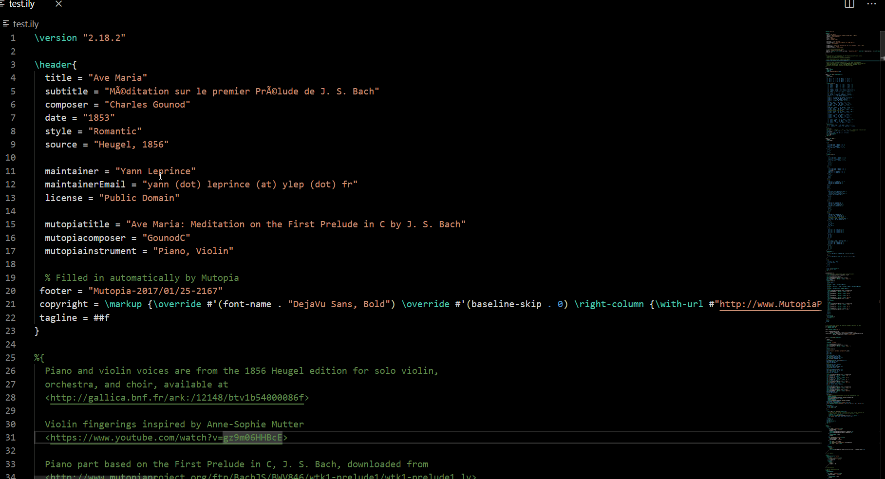
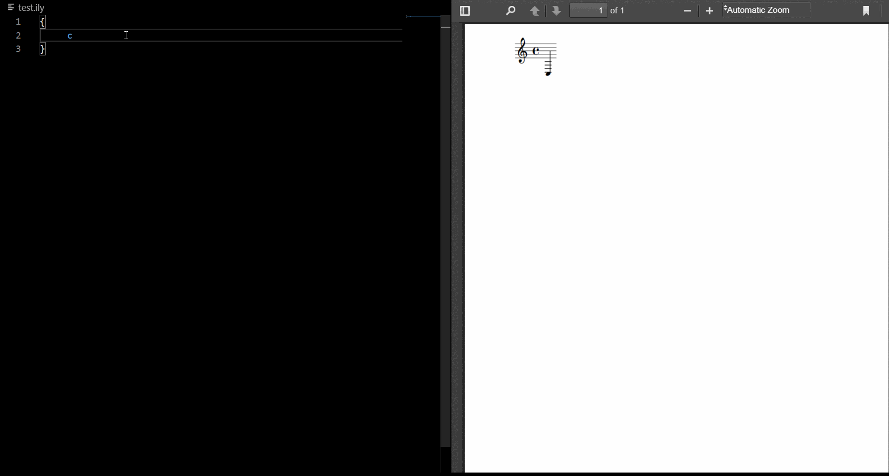
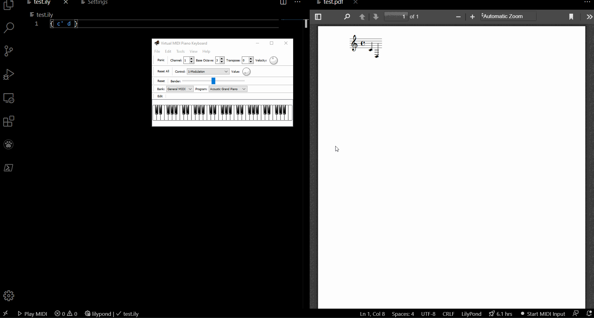
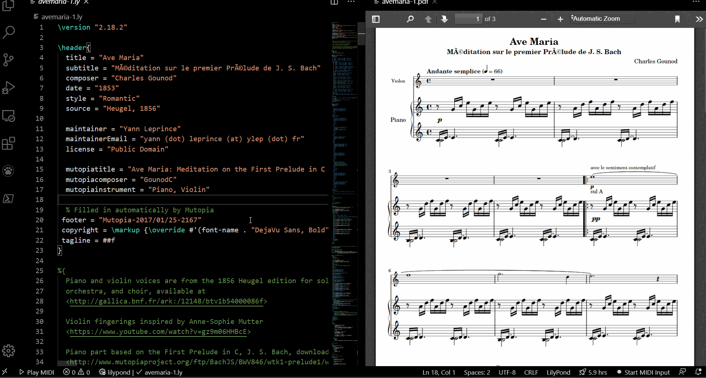

# VSLilyPond

[](https://marketplace.visualstudio.com/items?itemName=lhl2617.vslilypond)
[](https://vsmarketplacebadge.apphb.com/installs/lhl2617.vslilypond.svg)
[](https://marketplace.visualstudio.com/items?itemName=lhl2617.vslilypond)

Provides syntax and error highlighting, IntelliSense and AutoComplete, compilation on save, MIDI (input and playback) support for [LilyPond](http://lilypond.org/) in VSCode. Works with any VSCode supported PDF previewer for PDF preview.

See [docs/INSTALL.md](docs/INSTALL.md) for a setup guide.

## Features

### Error highlighting 📜 


### IntelliSense and AutoComplete 💡


### Compilation on save 💾


### MIDI Input 🎹

Supports chord mode, relative mode and sharp/flat accidentals. See [DEMOS.md](./docs/DEMOS.md) for advanced features in action, and [SETTINGS.md](./docs/SETTINGS.md) on how to toggle them.

### MIDI Playback 🎼



### Point and Click 📄


See [here](https://github.com/lhl2617/VSLilyPond-PDF-preview) for more information (including a usage guide).

## Requirements

See [docs/INSTALL.md](docs/INSTALL.md) for a setup guide.

* [VSCode](https://code.visualstudio.com/) 1.46.0 minimum
* [LilyPond](http://lilypond.org/) (Tested on 2.22.1)
* (Optional) MIDI Devices for MIDI Input and Playback
* (Optional for Windows, Linux and macOS users) [python-ly](https://pypi.org/project/python-ly/): Required for formatting (more information [here](https://marketplace.visualstudio.com/items?itemName=lhl2617.lilypond-formatter))

## Extension Controls, Commands and Settings

* Commands: See [docs/COMMANDS.md](docs/COMMANDS.md)
* Settings: See [docs/SETTINGS.md](docs/SETTINGS.md)
* Status Bar interface: See [docs/STATUSBAR.md](docs/STATUSBAR.md)

## Issues & FAQ

Please submit issues in the [GitHub repository](https://github.com/lhl2617/VSLilyPond).

See the FAQ at [docs/FAQ.md](docs/FAQ.md).

## Contributing

* File bugs and/or feature requests in the [GitHub repository](https://github.com/lhl2617/VSLilyPond)
* Pull requests are welcome in the [GitHub repository](https://github.com/lhl2617/VSLilyPond)
* Buy me a Coffee ☕️ via [PayPal](https://paypal.me/lhl2617)

## Development

#### Requirements

- [VSCode](https://code.visualstudio.com/)
- `npm`

#### Setup

- Clone repository
  ```bash
  git clone https://github.com/lhl2617/VSLilyPond
  ```
- Install `npm` dependencies
  ```bash
  npm i
  ```
- Hit `F5` to run an Extension Development Host.

  See [here](https://code.visualstudio.com/api/get-started/your-first-extension) for a detailed extension development guide.

#### Releasing

Releasing is done automatically via GitHub Actions. Bump the version in `package.json` and update `CHANGELOG.md` before merging into the default branch.
## Acknowledgements
Base syntax highlighting depends on the [LilyPond Syntax extension](https://marketplace.visualstudio.com/items?itemName=jeandeaual.lilypond-syntax) by [Alexis Jeandeau](https://github.com/jeandeaual), under the Creative Commons Attribution-NonCommercial 3.0 Unported (CC BY-NC 3.0) license (http://creativecommons.org/licenses/by-sa/3.0/). See that repository for additional acknowledgements.

IntelliSense and AutoComplete depends on the [LilyPond AutoComplete (Commands & Keywords) extension](https://marketplace.visualstudio.com/items?itemName=lhl2617.lilypond-snippets),
under the [MIT license](https://github.com/lhl2617/VSLilyPond-snippets/blob/master/LICENSE).

Formatting depends on the [LilyPond Formatter extension](https://marketplace.visualstudio.com/items?itemName=lhl2617.lilypond-formatter),
under the [MIT license](https://github.com/lhl2617/VSLilyPond-formatter/blob/master/LICENSE).

Point and Click depends on the [LilyPond PDF Preview extension](https://marketplace.visualstudio.com/items?itemName=lhl2617.lilypond-pdf-preview),
under the [MIT license](https://github.com/lhl2617/VSLilyPond-PDF-preview/blob/master/LICENSE).

License: Creative Commons Attribution-NonCommercial 3.0 Unported (CC BY-NC 3.0) license, http://creativecommons.org/licenses/by-sa/3.0/.
