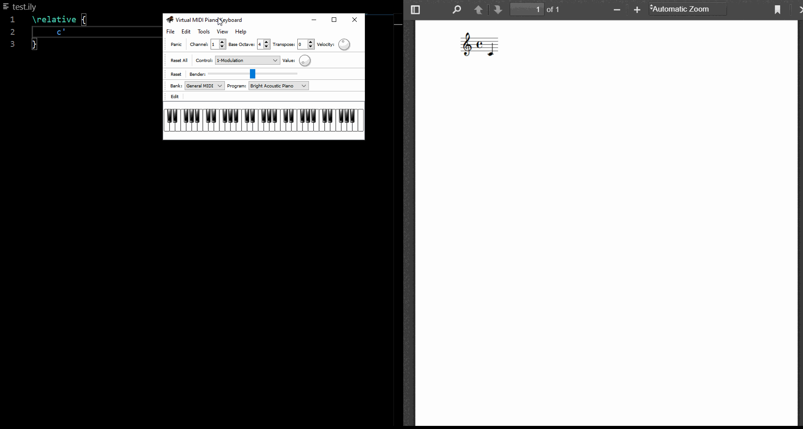
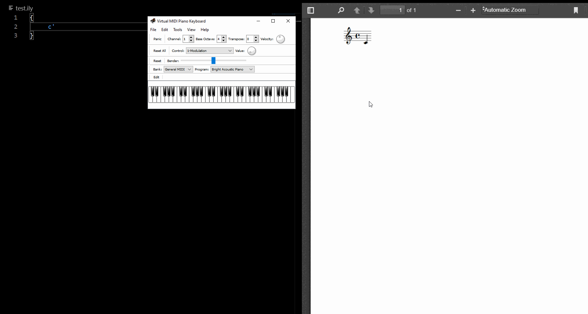
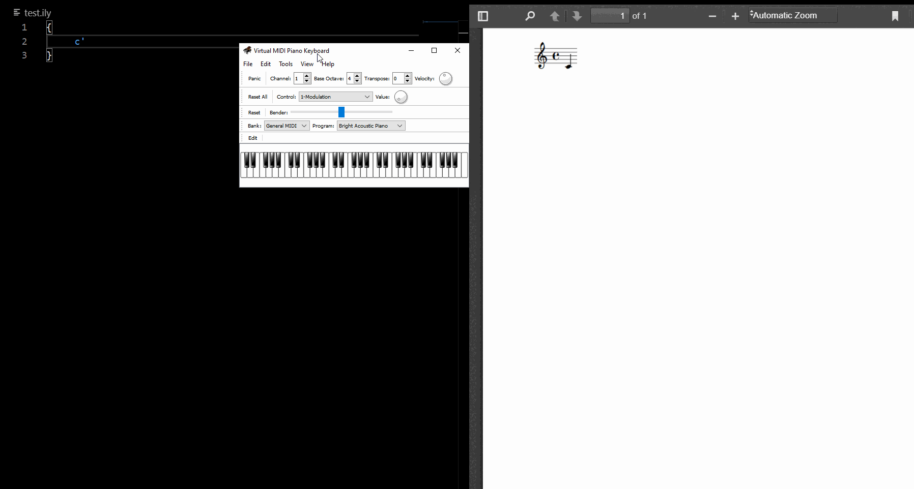

# Demos

## MIDI Input

### Relative & Absolute modes
Input in either relative or absolute mode. Set via Settings under `vslilypond.midiInput.relativeMode`
* Relative Mode

* Absolute Mode

### Accidentals
Input accidentals as sharps or flats. Set via Settings under `vslilypond.midiInput.accidentals`
* Flats

* Sharps

### Chord mode
When enabled, registers notes that are pressed and held together as a chord instead of sequential notes. Set via Settings under `vslilypond.midiInput.chordMode`
* Enabled

* Disabled
