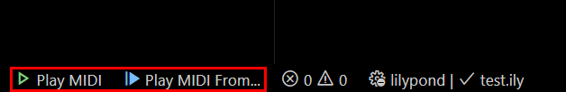
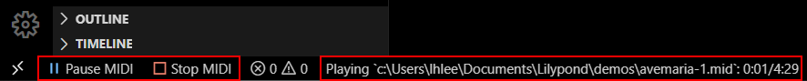
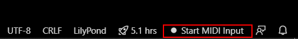
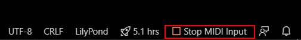

# VSLilyPond Status Bar

## MIDI Playback 

Left side of Status bar

### Play MIDI

Play/Resume MIDI and Play MIDI from a specific timestamp. You can also use commands under `VSLilyPond: MIDI Playback`. MIDI Playback device is set using `VSLilyPond: MIDI Playback: Set output device` command. 

### Control MIDI Playback

`Pause MIDI` and `Stop MIDI` allow you to control MIDI playback. There is also MIDI playback status. You can also use commands under `VSLilyPond: MIDI Playback`. 

## MIDI Input

### Start MIDI Input

Start MIDI Input. You can also use commands under `VSLilyPond: MIDI Input`. MIDI input device is set using `VSLilyPond: MIDI Playback: Set input device` command.  

### Stop MIDI Input

Stop MIDI Input. You can also use commands under `VSLilyPond: MIDI Input`. 